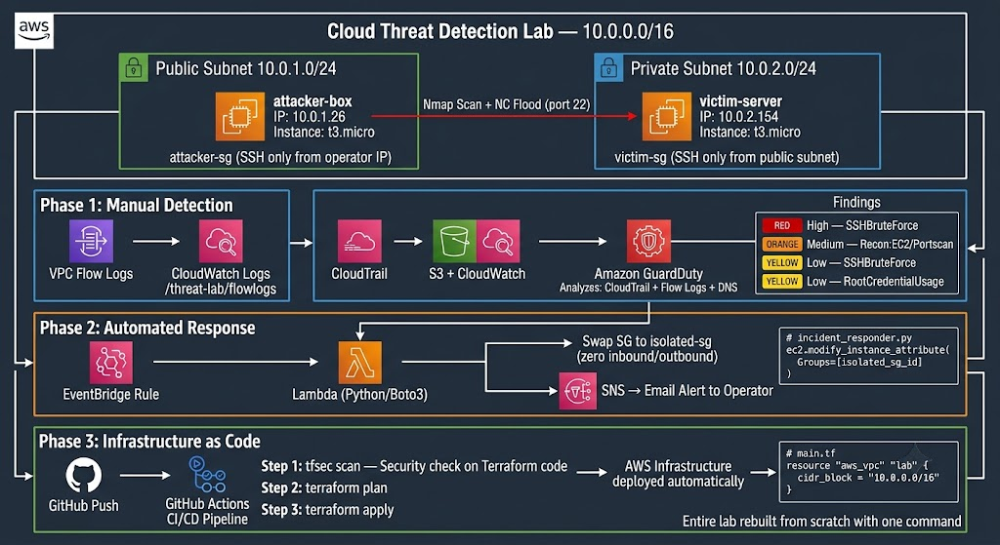

# 🛡️ Cloud Threat Detection Lab

> An AWS-native threat detection and automated incident response environment —  
> built progressively from manual console setup to fully automated Infrastructure as Code.

---

## 🎯 What This Project Does

This lab simulates a real cloud attack scenario: an adversary performing reconnaissance  
and brute-force attacks against an EC2 instance inside a private subnet.

The system detects the attack using AWS-native security services and — in its final form —  
automatically isolates the compromised instance in **under 30 seconds**, with no human intervention.

---

## 🏗️ Engineering Evolution: Manual → Automated → IaC

This project was deliberately built in 3 progressive phases.  
Each phase solves a limitation left by the previous one.  
This mirrors how security infrastructure matures in real cloud environments.

---

### 🔹 Phase 1 — Manual Infrastructure & Detection ✅ `COMPLETE`

**The problem this phase addresses:**  
Before automating anything, every component must be understood at the lowest level.

**What was built manually:**
- Custom VPC (`10.0.0.0/16`) with isolated public and private subnets
- Two EC2 instances: `attacker-box` (public subnet) and `victim-server` (private subnet)
- Security Groups enforcing least-privilege: victim accessible only from attacker subnet
- CloudTrail logging all API calls across the account
- VPC Flow Logs streaming all network traffic to CloudWatch
- Amazon GuardDuty analyzing CloudTrail + Flow Logs + DNS in real time

**Attack simulations executed:**
- Nmap aggressive scan (`-A -v -Pn`) from attacker to victim → GuardDuty raised `Recon:EC2/Portscan` (Medium)
- Hydra SSH brute-force → victim correctly rejected password auth — SSH hardening confirmed
- Netcat flood (200 concurrent TCP connections to port 22) → GuardDuty raised `UnauthorizedAccess:EC2/SSHBruteForce` (**High**)
- Root credential API usage → GuardDuty raised `Policy:IAMUser/RootCredentialUsage` (Low)

**Phase 1 limitation:**  
GuardDuty detects threats but does nothing automatically.  
A real attack at 3 AM would go unnoticed until someone manually checks the console.

→ [Full Phase 1 Documentation & Evidence](docs/phase1-manual-setup.md)

---

### 🔹 Phase 2 — Serverless Automated Response 🚧 `IN PROGRESS`

**The problem this phase addresses:**  
Manual detection without automated response is not enough.

**What will be built:**
- Amazon EventBridge rule capturing every GuardDuty finding in real time
- AWS Lambda (Python/Boto3) that automatically replaces the compromised instance's Security Group with `isolated-sg` (zero inbound, zero outbound)
- Amazon SNS sending an immediate email alert to the operator
- CloudWatch dashboard visualizing findings and response events

**Expected outcome:**  
Compromised instance isolated in under 30 seconds from detection, with full audit trail.

→ [Phase 2 Documentation](docs/phase2-automated-response.md) *(coming soon)*

---

### 🔹 Phase 3 — Infrastructure as Code & CI/CD 🚧 `PLANNED`

**The problem this phase addresses:**  
Manual setup is not reproducible and not reviewable by a team.

**What will be built:**
- Full Terraform refactor of all Phase 1 + Phase 2 infrastructure
- `tfsec` scanning Terraform configs for misconfigurations before deployment
- GitHub Actions CI/CD pipeline: push → tfsec scan → `terraform plan` → `terraform apply`
- Complete GitOps deployment — one command rebuilds the entire lab from scratch

**Expected outcome:**  
Entire lab deployable in minutes from a single `terraform apply`, with security scanning built into every deployment.

---

## 🏛️ Architecture




---

## 🛠️ Technologies

| Category | Tools |
|----------|-------|
| Cloud Infrastructure | AWS VPC, EC2, Subnets, Security Groups, Route Tables |
| Threat Detection | Amazon GuardDuty, CloudTrail, VPC Flow Logs, CloudWatch |
| Automated Response | AWS Lambda (Python), Amazon EventBridge, Amazon SNS |
| Infrastructure as Code | Terraform, tfsec |
| CI/CD | GitHub Actions |
| Attack Simulation | Nmap, Hydra |

---

## 📂 Repository Structure

```
cloud-threat-detection-lab/
├── README.md                          ← You are here
├── docs/
│   ├── phase1-manual-setup.md         ← Full Phase 1 documentation + evidence
│   ├── phase2-automated-response.md   ← Phase 2 (coming)
│   └── architecture-diagram.png       ← Visual architecture
├── lambda/
│   └── incident_responder.py          ← Phase 2: Python isolation function
├── terraform/
│   ├── main.tf                        ← Phase 3: Full infrastructure
│   ├── variables.tf
│   └── outputs.tf
└── .github/
    └── workflows/
        └── tf-security-cicd.yml       ← Phase 3: CI/CD pipeline
```

---

## ⚡ Key Results

| Phase | Milestone | Status |
|-------|-----------|--------|
| Phase 1 | VPC + EC2 + GuardDuty operational | ✅ Complete |
| Phase 1 | Nmap scan detected — `Recon:EC2/Portscan` (Medium) | ✅ Confirmed |
| Phase 1 | SSH brute force detected — `UnauthorizedAccess:EC2/SSHBruteForce` (**High**) | ✅ Confirmed |
| Phase 1 | SSH hardening validated — password auth correctly rejected by victim | ✅ Confirmed |
| Phase 1 | Root credential usage detected — `Policy:IAMUser/RootCredentialUsage` (Low) | ✅ Confirmed |
| Phase 1 | VPC Flow Logs capturing all traffic in CloudWatch | ✅ Confirmed |
| Phase 2 | Automated isolation via Lambda | 🚧 In progress |
| Phase 2 | SNS alert on GuardDuty finding | 🚧 In progress |
| Phase 3 | Full Terraform IaC | 📋 Planned |
| Phase 3 | GitHub Actions CI/CD with tfsec | 📋 Planned |

---

## 👤 Author

**Youssef Talbi**  
Cloud Security Engineering Student — TEK-UP University (2027)  
RHCSA · eJPTv2 · AWS Solutions Architect Associate  

[LinkedIn](https://linkedin.com/in/talbi-youssef) · [GitHub](https://github.com/YOUR_USERNAME)
