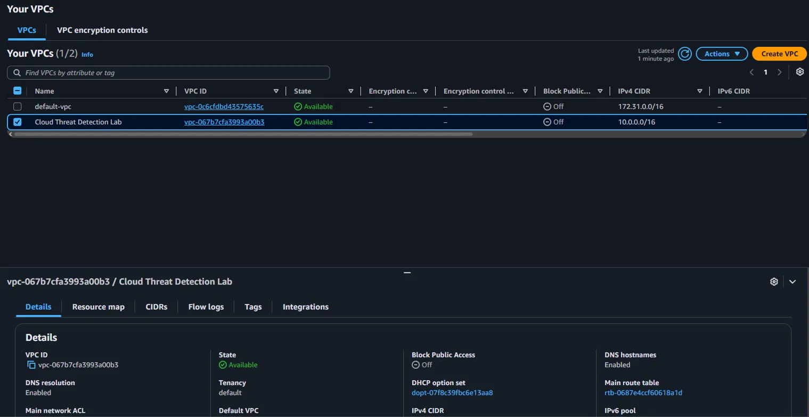
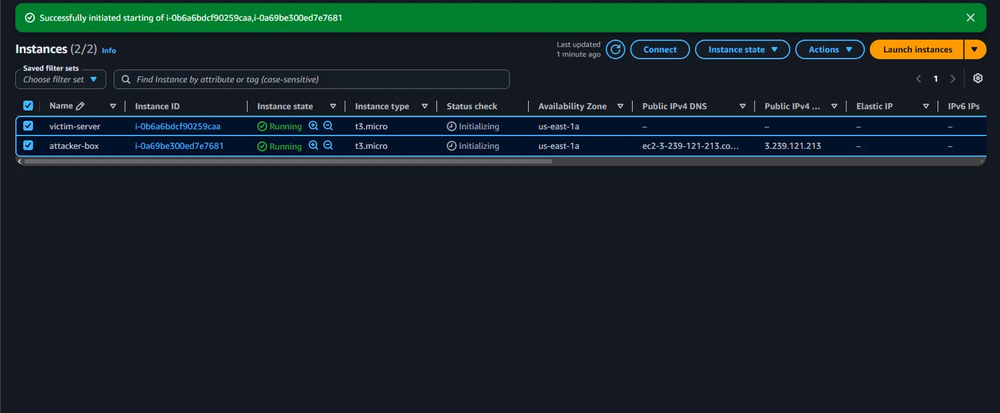
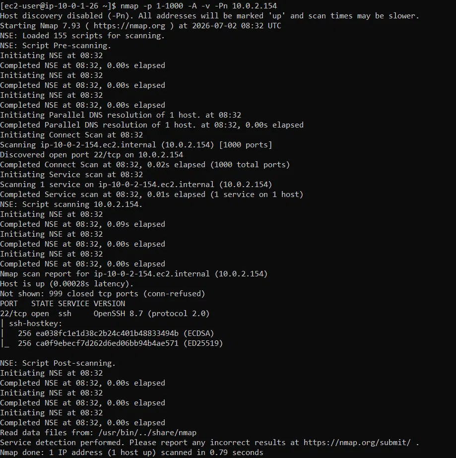
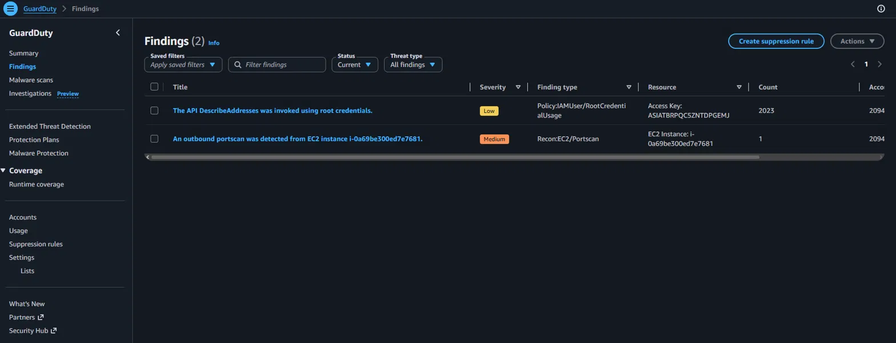
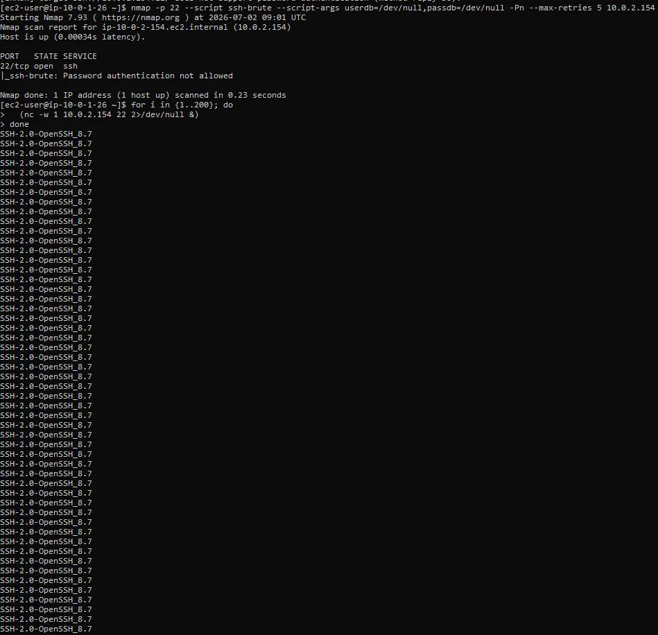
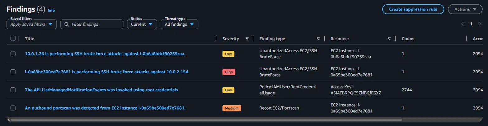

# Phase 1 — Manual Infrastructure & Threat Detection

## Objective

Build the entire lab environment from scratch using the AWS Console — no automation, no templates.  
The goal was to deeply understand each component before automating anything in later phases.  
Every resource was provisioned, configured, and validated manually.

---

## Architecture Overview

```
Internet
    │
    ▼
┌─────────────────────────────────────────────────┐
│           VPC: Cloud Threat Detection Lab        │
│                   10.0.0.0/16                    │
│                                                  │
│  ┌─────────────────────┐  ┌──────────────────┐  │
│  │   Public Subnet      │  │  Private Subnet  │  │
│  │   10.0.1.0/24        │  │  10.0.2.0/24     │  │
│  │                      │  │                  │  │
│  │  ┌───────────────┐   │  │  ┌───────────┐  │  │
│  │  │ attacker-box  │───┼──┼─►│victim-srv │  │  │
│  │  │ 10.0.1.26     │   │  │  │10.0.2.154 │  │  │
│  │  │ t3.micro      │   │  │  │ t3.micro  │  │  │
│  │  └───────────────┘   │  │  └───────────┘  │  │
│  └─────────────────────┘  └──────────────────┘  │
│                                                  │
│  VPC Flow Logs ──► CloudWatch: /threat-lab/flowlogs
│  CloudTrail   ──► S3 + CloudWatch               │
│  GuardDuty    ──► Analyzing all above sources    │
└─────────────────────────────────────────────────┘
```

---

## Infrastructure Built

### 1. VPC — `Cloud Threat Detection Lab`

| Parameter | Value |
|-----------|-------|
| VPC ID | vpc-067b7cfa3993a00b3 |
| IPv4 CIDR | 10.0.0.0/16 |
| DNS Hostnames | Enabled |
| DNS Resolution | Enabled |
| Public Subnet | 10.0.1.0/24 (us-east-1a) |
| Private Subnet | 10.0.2.0/24 (us-east-1a) |


## VPC Setup



### 2. Security Groups

**victim-sg** (`sg-0fddfdfc4f769b5ed`)

| Direction | Type | Protocol | Port | Source |
|-----------|------|----------|------|--------|
| Inbound | All traffic | All | All | 10.0.0.0/16 (VPC only) |
| Inbound | SSH | TCP | 22 | 10.0.1.0/24 (attacker subnet only) |
| Outbound | All traffic | All | All | 0.0.0.0/0 |

**attacker-sg** (`sg-097b3a891a5388a77`)

| Direction | Type | Protocol | Port | Source |
|-----------|------|----------|------|--------|
| Inbound | SSH | TCP | 22 | 197.26.104.189/32 (operator IP only) |
| Outbound | All traffic | All | All | 0.0.0.0/0 |

**isolated-sg** — zero inbound, zero outbound (used in Phase 2 for automated isolation)

### 3. EC2 Instances

| Property | attacker-box | victim-server |
|----------|-------------|---------------|
| Instance ID | i-0a69be300ed7e7681 | i-0b6a6bdcf90259caa |
| Type | t3.micro | t3.micro |
| Subnet | Public (10.0.1.0/24) | Private (10.0.2.0/24) |
| Private IP | 10.0.1.26 | 10.0.2.154 |
| Public IP | 3.239.121.213 | None |
| AMI | Amazon Linux 2023 | Amazon Linux 2023 |


## EC2 Instances Running


### 4. VPC Flow Logs

| Parameter | Value |
|-----------|-------|
| Flow Log ID | fl-0a72560fba52f4fd3 |
| Traffic Type | ALL (Accept + Reject) |
| Destination | CloudWatch Logs |
| Log Group | /threat-lab/flowlogs |


## VPC Flow Logs — CloudWatch


Executed from `attacker-box` (10.0.1.26) targeting `victim-server` (10.0.2.154):

```bash
nmap -p 1-1000 -A -v -Pn 10.0.2.154
```

**Result:** Port 22/tcp open — OpenSSH 8.7 (protocol 2.0) detected.  
SSH host keys fingerprinted: ECDSA and ED25519.

## Nmap Scan — Terminal Output



**GuardDuty Finding Generated:**
- Title: `An outbound portscan was detected from EC2 instance i-0a69be300ed7e7681`
- Severity: **Medium**
- Type: `Recon:EC2/Portscan`
- Resource: EC2 Instance `i-0a69be300ed7e7681`

## GuardDuty Finding



### Attack 2 — SSH Brute Force (Netcat flood + Nmap ssh-brute)

First attempt with Hydra confirmed victim hardening — password auth rejected immediately:

```bash
hydra -l ec2-user -P key_list.txt -t 4 -f ssh://10.0.2.154 -s 22 -v
# Result: does not support password authentication (method reply 36)
```

Then escalated to high-volume TCP connection flood on port 22:

```bash
nmap -p 22 --script ssh-brute --script-args userdb=/dev/null,passdb=/dev/null -Pn --max-retries 5 10.0.2.154

for i in {1..200}; do
  (nc -w 1 10.0.2.154 22 2>/dev/null &)
done
```

**Result:** 200 concurrent TCP connections to port 22 generated sufficient volume  
for GuardDuty to detect the brute force pattern via VPC Flow Logs analysis.


## SSH Brute Force — Terminal Output



**GuardDuty Findings Generated:**
- Title: `i-0a69be300ed7e7681 is performing SSH brute force attacks against 10.0.2.154`
  - Severity: **High**
  - Type: `UnauthorizedAccess:EC2/SSHBruteForce`
  - Resource: attacker-box (i-0a69be300ed7e7681)

- Title: `10.0.1.26 is performing SSH brute force attacks against i-0b6a6bdcf90259caa`
  - Severity: **Low**
  - Type: `UnauthorizedAccess:EC2/SSHBruteForce`
  - Resource: victim-server (i-0b6a6bdcf90259caa)

### Attack 3 — Root Credential API Call

GuardDuty independently detected use of root credentials for API calls.

**GuardDuty Finding Generated:**
- Title: `The API ListManagedNotificationEvents was invoked using root credentials`
- Severity: **Low**
- Type: `Policy:IAMUser/RootCredentialUsage`
- Count: 2744 occurrences

---

## Evidence — GuardDuty Findings

Four findings confirmed at end of Phase 1:

| Finding | Severity | Type | Source |
|---------|----------|------|--------|
| SSH brute force from attacker-box | **High** | UnauthorizedAccess:EC2/SSHBruteForce | nc flood simulation |
| SSH brute force against victim | Low | UnauthorizedAccess:EC2/SSHBruteForce | nc flood simulation |
| Outbound portscan from attacker-box | Medium | Recon:EC2/Portscan | Nmap simulation |
| Root credentials used for API call | Low | Policy:IAMUser/RootCredentialUsage | CloudTrail |


## GuardDuty — 4 Findings Confirmed

---

## VPC Flow Logs — CloudWatch Evidence

Flow logs captured all traffic between 10.0.1.26 (attacker) and 10.0.2.154 (victim)  
during the Nmap scan at `2026-07-02T08:32:04.000Z`.  
Logs show bidirectional TCP flows across multiple ports — confirming active reconnaissance  
was recorded at the network layer, independently of GuardDuty.

---

## Key Takeaways from Phase 1

- Every AWS resource was provisioned manually to build genuine understanding of VPC networking, subnet isolation, and security group chaining
- GuardDuty successfully detected reconnaissance activity (`Recon:EC2/Portscan`) within minutes of the Nmap scan
- VPC Flow Logs provide raw packet-level evidence in CloudWatch, independent of GuardDuty
- The victim instance correctly rejected password-based SSH — confirming security hardening works
- **Phase 1 limitation:** Detection is passive — findings appear in GuardDuty but require manual review and response. This is the problem Phase 2 solves.

---

## What Phase 2 Fixes

Manual detection is not enough. A real attack at 3 AM would go unnoticed until an engineer logs in.  
Phase 2 introduces automated incident response: EventBridge catches every GuardDuty finding,  
triggers a Python Lambda function, and automatically isolates the compromised instance  
by replacing its Security Group with `isolated-sg` — in under 30 seconds.

→ [Phase 2 Documentation](phase2-automated-response.md) *(coming soon)*
