# Phase 2 — Automated Incident Response

## The Problem Phase 1 Left Unsolved

Phase 1 proved that GuardDuty can detect real attacks. But detection alone is not enough.

When GuardDuty raises a finding, nothing happens automatically. A real attacker at 3 AM
would have hours of free access inside the network before any engineer notices the alert
and manually responds. That gap between detection and response is where breaches happen.

**Phase 2 closes that gap.**

---

## The Solution: A Serverless Response Pipeline

Every GuardDuty finding now triggers an automated chain that runs in under 30 seconds —
no human required, no manual login, no delay.

```
GuardDuty Finding (High/Medium severity)
         │
         ▼
  EventBridge Rule
  "threat-lab-guardduty-trigger"
  catches every GuardDuty finding in real time
         │
         ▼
  Lambda Function (Python / Boto3)
  "threat-lab-incident-responder"
  parses the finding, evaluates severity
         │
         ├──► EC2: Swap Security Group → isolated-sg
         │    (zero inbound, zero outbound)
         │    Instance is now completely cut off
         │
         └──► SNS → Email Alert
              Full finding details delivered instantly
```

---

## Components Built

### 1. IAM Role — `threat-lab-lambda-role`

Before Lambda can touch any AWS resource, it needs explicit permissions.
A dedicated IAM role was created with two policies attached:

| Policy | Purpose |
|--------|---------|
| `AWSLambdaBasicExecutionRole` | Write execution logs to CloudWatch |
| `threat-lab-lambda-policy` (custom) | Modify EC2 Security Groups + publish to SNS |

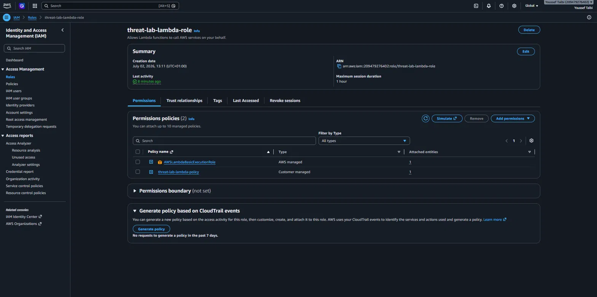

The role follows least-privilege — Lambda can only do exactly what the response
workflow requires, nothing else.

---

### 2. SNS Topic — `threat-lab-alerts`

An SNS topic receives the alert published by Lambda and forwards it as an email.

| Parameter | Value |
|-----------|-------|
| Topic name | threat-lab-alerts |
| ARN | arn:aws:sns:us-east-1:209479276402:threat-lab-alerts |
| Protocol | Email |
| Endpoint | iam.yousseftalbi@gmail.com |
| Status | ✅ Confirmed |

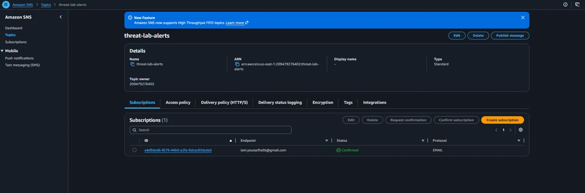

---

### 3. Lambda Function — `threat-lab-incident-responder`

The core of the automated response. Written in Python 3.12 using Boto3.

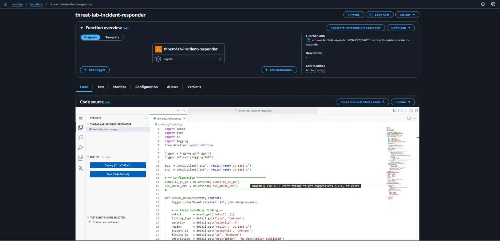

**What the function does, step by step:**

1. Receives the full GuardDuty finding from EventBridge
2. Parses finding type, severity score, region, account ID, and affected instance ID
3. If severity ≥ 4 (Medium or above) AND an EC2 instance is involved:
   - Calls `ec2.modify_instance_attribute()` to replace the active Security Group with `isolated-sg`
   - The instance loses all inbound and outbound connectivity instantly
4. Builds a detailed alert message with all finding metadata
5. Publishes the alert to SNS → delivered to operator email

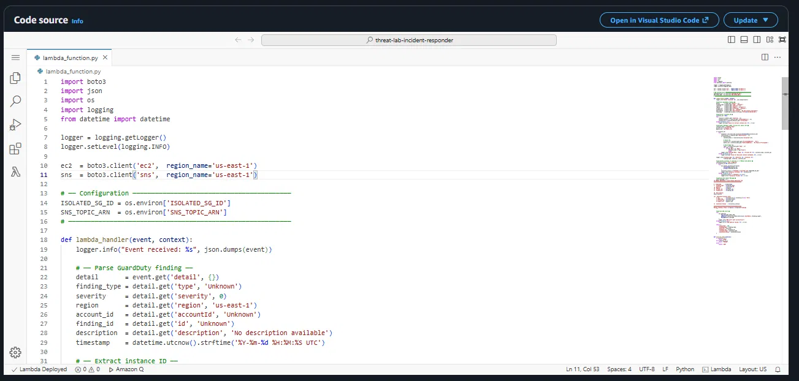

**Environment variables** keep sensitive resource IDs out of the code:

| Key | Value |
|-----|-------|
| `ISOLATED_SG_ID` | sg-054d7c62446b19598 |
| `SNS_TOPIC_ARN` | arn:aws:sns:us-east-1:209479276402:threat-lab-alerts |

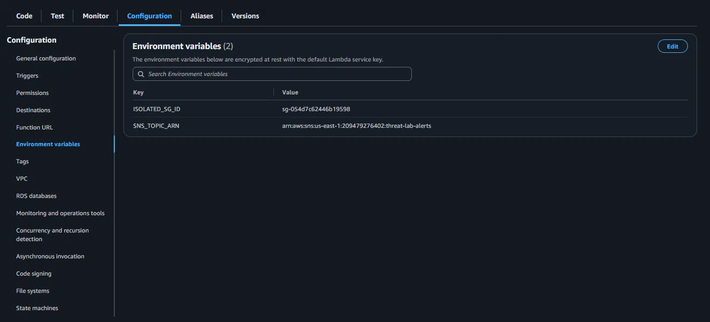

---

### 4. EventBridge Rule — `threat-lab-guardduty-trigger`

The rule listens to the AWS default event bus and captures every GuardDuty finding
the moment it is generated — with zero polling delay.

**Event pattern:**
```json
{
  "source": ["aws.guardduty"],
  "detail-type": ["GuardDuty Finding"]
}
```

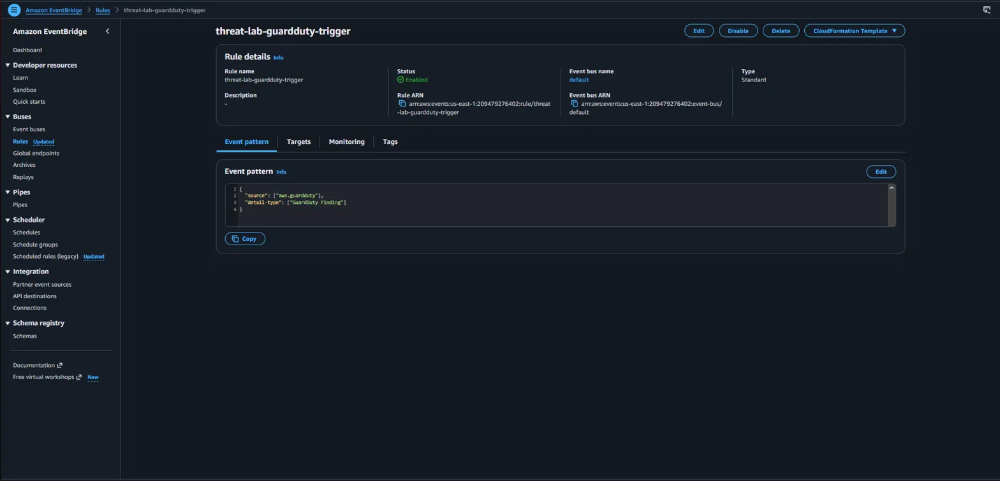

**Target:** Lambda function `threat-lab-incident-responder`

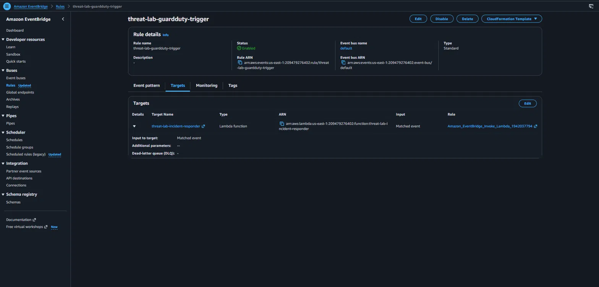

---

## The Pipeline in Action — Real Attack, Real Response

### Step 1 — Attack launched from attacker-box

SSH brute force attack executed from `attacker-box` (10.0.1.26) targeting
`victim-server` (10.0.2.154) — 100 parallel SSH connection attempts using
invalid usernames and password authentication.

### Step 2 — GuardDuty detects the threat

Three findings generated on July 5, 2026:

| Finding | Severity | Type | Last seen |
|---------|----------|------|-----------|
| SSH brute force from i-0a69be300ed7e7681 | **High** | UnauthorizedAccess:EC2/SSHBruteForce | 35 min ago |
| Outbound portscan from i-0a69be300ed7e7681 | Medium | Recon:EC2/Portscan | 6 min ago |
| Root credentials used for API call | Low | Policy:IAMUser/RootCredentialUsage | 7 min ago |

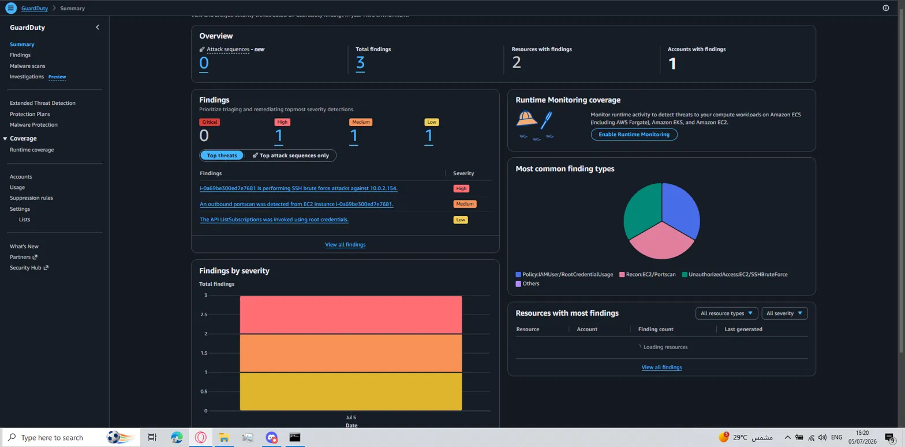

### Step 3 — Lambda executes automatically

EventBridge captured the High severity finding and triggered Lambda.
CloudWatch Logs show 21 execution streams — the pipeline fired on every finding.

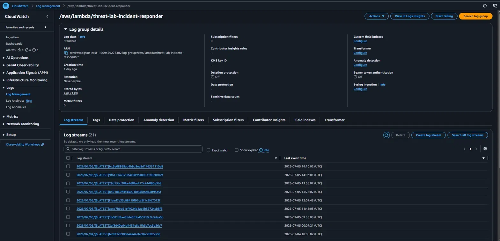

### Step 4 — Instance isolated automatically

The Lambda function called `ec2.modify_instance_attribute()` and replaced
`victim-server`'s Security Group with `isolated-sg`.

The AWS console confirms:

> **"Security groups for eni-0fcd5f513276462b1 changed successfully"**

`victim-server` now shows `isolated-sg` — zero inbound rules, zero outbound rules.
The instance is completely cut off from the network. No traffic in, no traffic out.

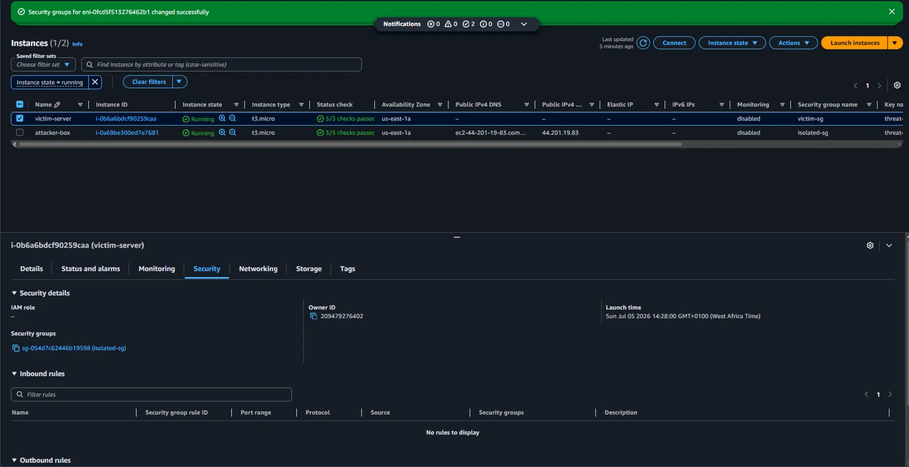

### Step 5 — Operator receives the alert email

Within seconds of the finding, the operator received a structured email via SNS:

```
🚨 THREAT DETECTED — Cloud Threat Detection Lab

⏱  Timestamp     : 2026-07-05 14:04:32 UTC
🔍  Finding Type  : UnauthorizedAccess:EC2/SSHBruteForce
⚠️  Severity      : 8/10
🌍  Region        : us-east-1
🏦  Account ID    : 209479276402

🖥️  Affected Instance : i-0b6a6bdcf90259caa (victim-server)
     Private IP        : 10.0.2.154

🔒  Isolation Status  : SUCCESS — Isolated with sg-054d7c62446b19598
```

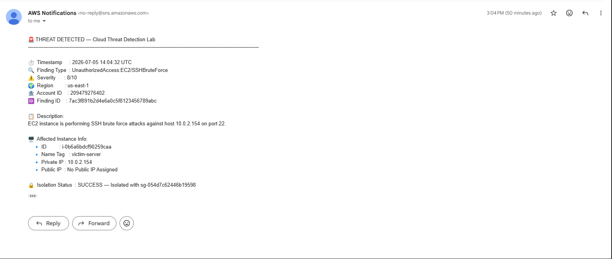

---

## Results

| Metric | Result |
|--------|--------|
| Time from GuardDuty finding to isolation | < 30 seconds |
| Human intervention required | None |
| Instance connectivity after isolation | Zero (no inbound, no outbound) |
| Alert delivery | Email via SNS — instant |
| Lambda executions logged | 21 streams in CloudWatch |

---

## Phase 2 Limitation

The automated response works — but the infrastructure itself is still entirely
manual. Every resource (VPC, EC2, Lambda, EventBridge, SNS) was configured
by hand through the AWS Console.

This means:
- Reproducing the lab from scratch takes hours of manual work
- There is no version control on the infrastructure
- Configuration drift can happen silently with no audit trail
- A team cannot review infrastructure changes before they are applied

**Phase 3 solves this** by converting every resource into Terraform code,
with a GitHub Actions CI/CD pipeline that scans for security issues
before any deployment.

→ [Phase 3 Documentation](phase3-terraform-cicd.md) *(coming soon)*
