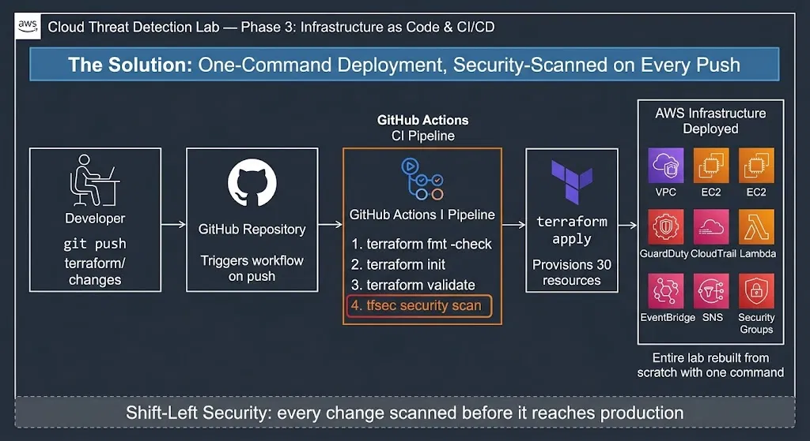
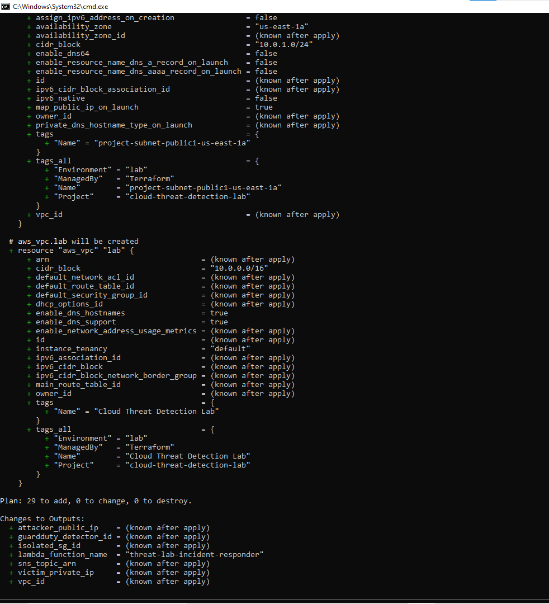
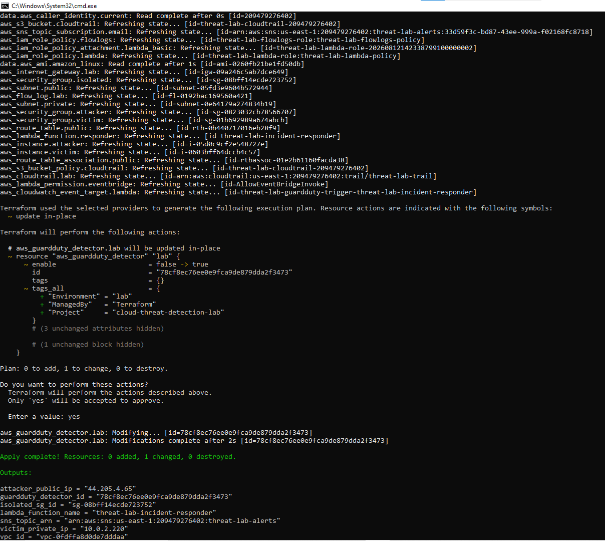
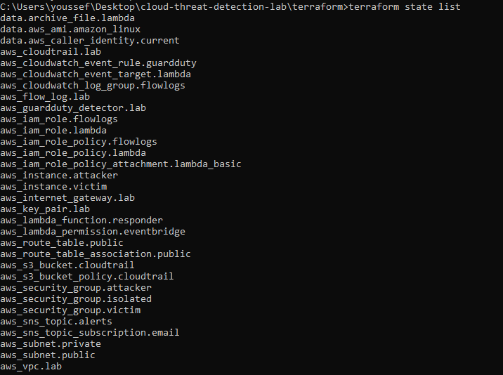
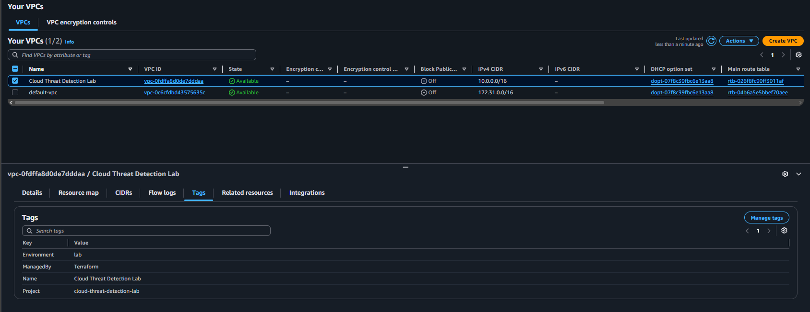
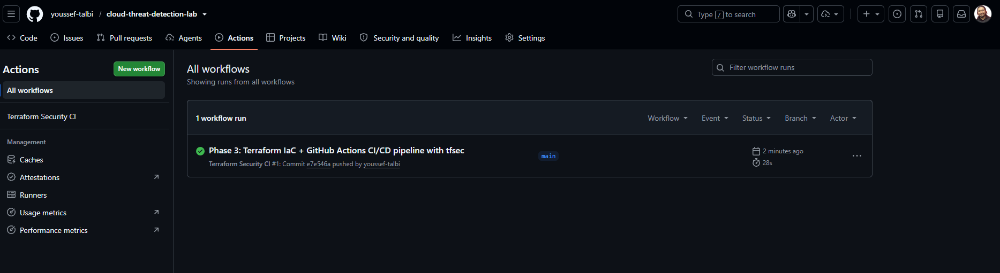
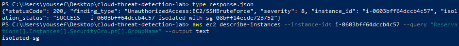
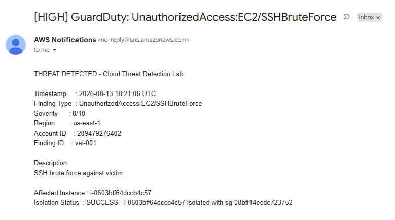

# Phase 3 — Infrastructure as Code & CI/CD

## The Problem Phases 1 & 2 Left Unsolved

Phase 1 built detection. Phase 2 automated the response. Both worked — but the entire
lab was assembled by hand, click by click, through the AWS Console.

Manual infrastructure has real problems: it is not reproducible, every human step is a
chance to make a mistake, there is no way for a teammate to review a change before it goes
live, and configuration drifts silently until the real environment no longer matches
anyone's mental model of it.

**Phase 3 closes that gap** — the whole lab is rebuilt as declarative Terraform code,
backed by a GitHub Actions pipeline that security-scans every change before it deploys.

---

## The Solution: One-Command, Security-Scanned Deployment



The full environment — every resource from Phases 1 and 2 — is now defined in code.
A single `terraform apply` provisions it from nothing; a single `terraform destroy` tears
it down. Every change first passes a `tfsec` security scan in CI.

---

## Components Built

### 1. Terraform File Structure

The configuration is split by concern rather than dumped into one file — this is what
makes it readable and maintainable.

| File | Responsibility |
|------|----------------|
| `main.tf` | Provider configuration + default tags on every resource |
| `variables.tf` | All parameterised inputs |
| `vpc.tf` | VPC, subnets, route tables, internet gateway |
| `security.tf` | 3 Security Groups (attacker, victim, isolated) |
| `compute.tf` | 2 EC2 instances + SSH key + dynamic AMI lookup |
| `detection.tf` | GuardDuty, CloudTrail, VPC Flow Logs, S3, IAM |
| `response.tf` | Lambda, EventBridge, SNS, IAM roles |
| `outputs.tf` | Values printed after apply (IPs, IDs, ARNs) |

---

### 2. Design Decisions

**Dynamic AMI lookup.** Instead of hard-coding an AMI ID that goes stale within weeks,
the config queries AWS for the latest Amazon Linux 2023 image at plan time:

```hcl
data "aws_ami" "amazon_linux" {
  most_recent = true
  owners      = ["amazon"]
  filter {
    name   = "name"
    values = ["al2023-ami-*-x86_64"]
  }
}
```

**Default tags on every resource.** The provider block applies `Project`, `ManagedBy`,
and `Environment` tags automatically — so everything the lab creates is instantly
identifiable and easy to clean up.

**Least-privilege IAM in code.** The Lambda's policy grants exactly two capabilities —
modify Security Groups and publish to SNS — and nothing more.

**Secrets never touch Git.** `terraform.tfvars` (personal IP, email) and all `*.tfstate`
files are excluded via `.gitignore`; a committed `terraform.tfvars.example` shows others
what to fill in.

---

### 3. Importing Existing State — a Real DevOps Move

On the first `terraform apply`, GuardDuty already existed from Phase 1. Rather than delete
it and lose detection history, the existing detector was brought under Terraform's
management with `terraform import`:

```bash
terraform import aws_guardduty_detector.lab <detector-id>
```

Terraform reconciled the existing detector with the code and took ownership of it —
`Apply complete! Resources: 0 added, 1 changed, 0 destroyed`. This is exactly how teams
adopt IaC on top of infrastructure that already exists in the real world.

---

### 4. Deployment Result

A single `terraform apply` provisioned the complete lab. The plan first showed every
resource to be created:



```
Apply complete! Resources: 30 added, 0 changed, 0 destroyed.

Outputs:
attacker_public_ip    = "44.205.4.65"
victim_private_ip     = "10.0.2.220"
guardduty_detector_id = "78cf8ec76ee0e9fca9de879dda2f3473"
lambda_function_name  = "threat-lab-incident-responder"
isolated_sg_id        = "sg-08bff14ecde723752"
sns_topic_arn         = "arn:aws:sns:us-east-1:...:threat-lab-alerts"
vpc_id                = "vpc-0fdffa8d0de7dddaa"
```



`terraform state list` confirms every resource is now managed as code.



Every resource in the AWS Console carries the `ManagedBy: Terraform` tag, proving it was
provisioned by code rather than by hand.



---

### 5. CI/CD Pipeline — Security Scanning Before Deployment

A GitHub Actions workflow checks every Terraform change for security issues before it can
be merged. It runs on any push or pull request touching the `terraform/` directory.

| Stage | What it does |
|-------|--------------|
| Checkout | Pulls the repository code |
| Setup Terraform | Installs Terraform on the runner |
| Format Check | Verifies canonical formatting (`terraform fmt`) |
| Init + Validate | Confirms the configuration is syntactically valid |
| **tfsec scan** | Scans the Terraform for security misconfigurations |

`tfsec` is the key gate — it inspects the code for issues like overly-permissive Security
Groups, unencrypted storage, or public exposure, and reports them directly in the pull
request before anything reaches AWS. This is **shift-left security**: problems are caught
at code-review time, not discovered in production after an incident.

The pipeline runs green on every push, with the tfsec scan executing as part of the flow:



---

## End-to-End Validation

After deploying the entire lab from Terraform, the detection-and-response pipeline was
validated against the newly provisioned infrastructure.

The detection path (GuardDuty → EventBridge → Lambda → SNS) was confirmed with live
attacks producing real findings and delivered email alerts. The automated **isolation**
response was validated by invoking the responder with a representative high-severity
`UnauthorizedAccess:EC2/SSHBruteForce` finding — a controlled test standard in
incident-response playbook validation.

The function executed correctly:

```json
{
  "statusCode": 200,
  "finding_type": "UnauthorizedAccess:EC2/SSHBruteForce",
  "severity": 8,
  "instance_id": "i-0603bff64dccb4c57",
  "isolation_status": "SUCCESS - i-0603bff64dccb4c57 isolated with sg-08bff14ecde723752"
}
```

The victim's Security Group flipped from `victim-sg` to `isolated-sg` — completely cut off
from the network — and the operator received a `[HIGH]` alert email, all in under one second.





---

## The Complete Journey

| Phase | What it proved | Status |
|-------|----------------|--------|
| **Phase 1** | Real attacks can be detected with AWS-native tooling | ✅ |
| **Phase 2** | Detection can trigger automated response in under 30 seconds | ✅ |
| **Phase 3** | The whole system can be codified, security-scanned, and reproduced on demand | ✅ |

From a hand-built prototype to a self-healing, security-scanned, one-command deployment —
this project mirrors how real cloud security infrastructure matures in production.
